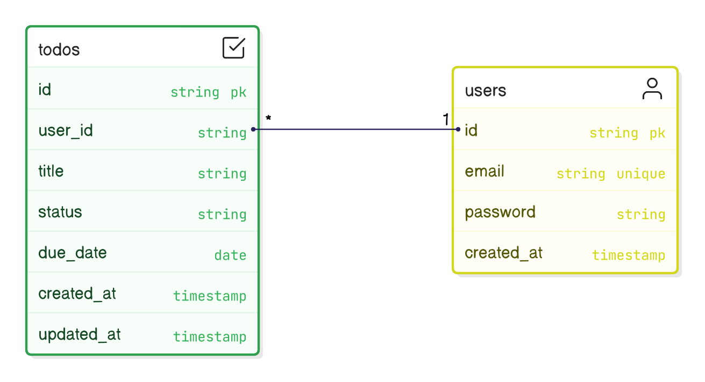

# 5. Database Schema

## Users Table
| Column     | Type     | Constraints |
|------------|----------|-------------|
| id         | INTEGER  | PK, auto-increment |
| email      | VARCHAR  | Unique, not null |
| password   | VARCHAR  | Hashed, not null |
| created_at | TIMESTAMP| Default now |

## TODOs Table
| Column     | Type     | Constraints |
|------------|----------|-------------|
| id         | INTEGER  | PK, auto-increment |
| user_id    | INTEGER  | FK (users.id), not null |
| title      | VARCHAR  | Not null |
| status     | ENUM     | todo / in progress / completed |
| due_date   | DATE     | Nullable |
| created_at | TIMESTAMP| Default now |
| updated_at | TIMESTAMP| On update |

## Relationships
- One-to-many relationship: User → TODOs.
- On delete cascade: removing user deletes their TODOs.

## ER Diagram
**Users (1) → (many) TODOs**

