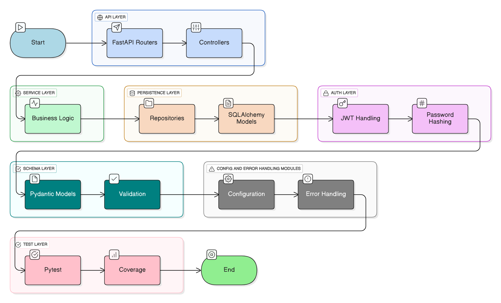
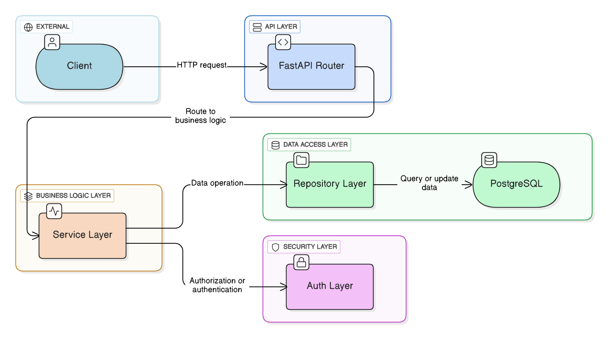

# 6. Architecture & Workflow

## 6.1 Layered Architecture Overview
- **API Layer (FastAPI Routers):** Handles HTTP requests/responses.
- **Service Layer:** Implements business logic, validation, transactions.
- **Persistence Layer (SQLAlchemy Repositories):** DB operations.
- **Auth Layer:** JWT validation middleware.
- **Schema Layer:** Pydantic models enforce type safety.
- **Test Layer:** pytest & coverage with fixtures.

## 6.2 Request Workflow
1. Client sends HTTP request.
2. FastAPI router maps route → Pydantic validates input.
3. Service layer executes business logic.
4. Repository layer interacts with DB via SQLAlchemy.
5. Response returned with proper status code.

## 6.3 Security Flow
- Password hashed via bcrypt on registration.
- JWT issued on login, verified on each request.

## 6.4 Example Diagram

